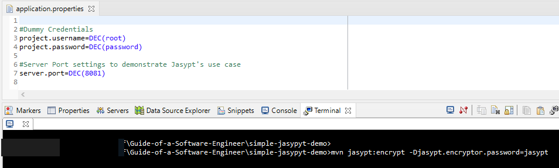
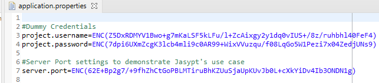
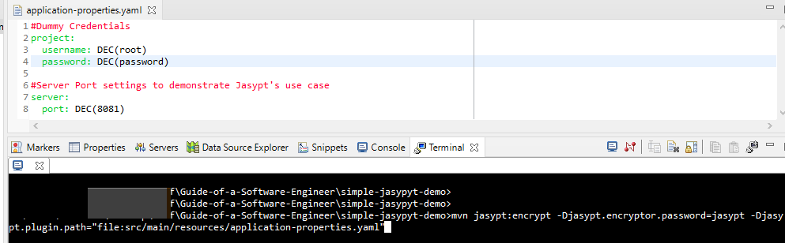
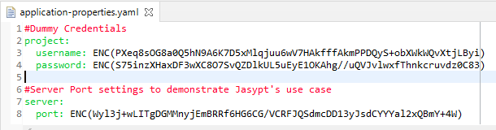
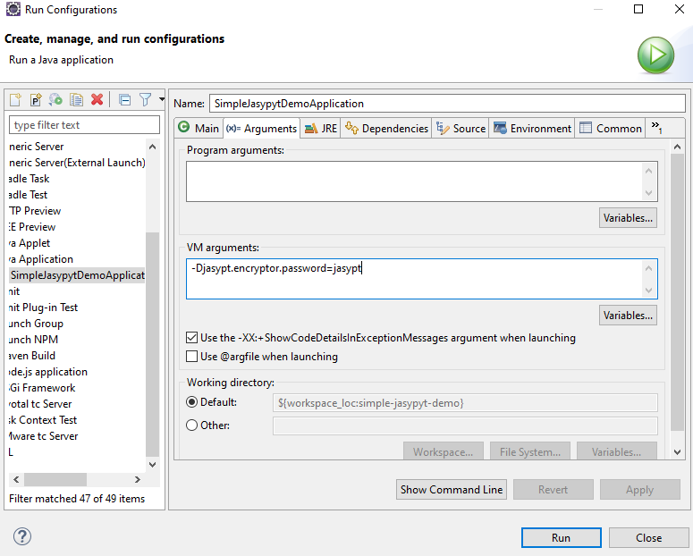

# Jasypt
Jasypt is a Java library which allows developers to add basic encryption capabilities to projects with minimum effort, and without the need of having an in-depth knowledge about implementation details of encryption protocols. Respective dependencies and plugins need to be configured in the pom.xml of a Spring Boot application for the implementation of Jasypt. To know more, visit [Jasypt](http://www.jasypt.org/)

## Pre-requisites
The following dependencies need to be present and configured in your system:
* Java 11 or higher
* Maven
* Java IDE (such as Eclipse), if you want to modify the code further

## How to Build and Run
Follow these steps:

1. Clone [this repo](https://github.com/darkhorse1998/Guide-of-a-Software-Engineer). It is suggested that you clone the entire repo and then move on to individual modules.
2. Open the cloned repo and change directory into the simple-spring-security by ```cd simple-jasypt-demo```
3. Build a JAR by ```mvn clean package```
4. Run the JAR by ```java -Djasypt.encryptor.password=jasypt -jar target/simple-jasypyt-demo-0.0.1-SNAPSHOT.jar```
5. By default, the application will run on port 8081. Make sure the port is not pre-occupied and is functioning properly. You can also tweak the port settings later.
6. Endpoint can be tested by sending a request (GET) to ```http://localhost:8081/``` . Please refer to the **Configuration** section below.

## Configuration
* Enpoints: The configured enpoints are:
    * ```/``` : a test endpoint.

* Jasypt Configurations:
1. Default: By default, Jasypt will implement encryption in the **application.properties** file. The contents which need to be encrypted should placed inside a **DEC()** property.
<br />

Example: ```project.password=DEC(password)```
<br />

State of *application.properties* file before encryption:
<br />


<br />

To get the contents encrypted, run ```mvn jasypt:encrypt -Djasypt.encryptor.password=<private-key>```<br />

Replace ```<private-key>``` with any desired key for the encryption. This will be used to decrypt the contents later. In the given project, the **private-key** is set to **jasypt**
<br />

State of *application.properties* file after encryption:
<br />


<br />

2. Custom: If the properties are present in a *.yaml* file, its location must be specified while encrypting.
<br />


<br />

To get the contents encrypted, run ```mvn jasypt:encrypt -Djasypt.encryptor.password=<private-key> -Djasypt.plugin.path="file:<location-of-file>"```<br />
Example: ```mvn jasypt:encrypt -Djasypt.encryptor.password=jasypt -Djasypt.plugin.path="file:src/main/resources/application-properties.yaml"```
<br />



**Note**: If you want to run the Spring Boot project as a Java application, you have to provide ```-Djasypt.encryptor.password=<private-key>``` in the *VM arguments* in the *Run-Configuration*.
<br />

Run Configurations
<br />



Endnote: The JAR name may vary if you have customised the build in the pom.xml