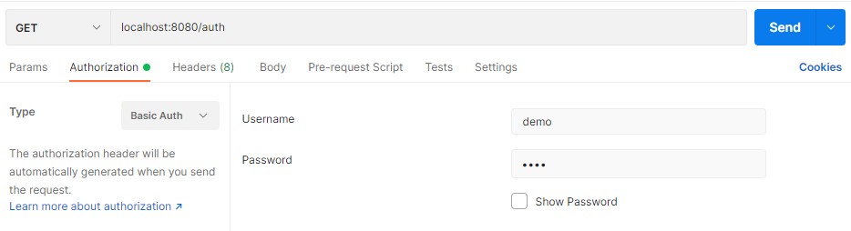

# Spring Security
Spring Security is a framework that focuses on providing both authentication and authorization to Java applications. Like all Spring projects, the real power of Spring Security is found in how easily it can be extended to meet custom requirements. To know more, visit [Spring Security](https://spring.io/projects/spring-security)

## Pre-requisites
The following dependencies need to be present and configured in your system:
* Java 11 or higher
* Maven
* Java IDE (such as Eclipse), if you want to modify the code further

## How to Build and Run
Follow these steps:

1. Clone [this repo](https://github.com/darkhorse1998/Guide-of-a-Software-Engineer). It is suggested that you clone the entire repo and then move on to individual modules.
2. Open the cloned repo and change directory into the simple-spring-security by ```cd simple-spring-security```
3. Build a JAR by ```mvn clean package```
4. Run the JAR by ```java -jar target/simplespringsecurity-0.0.1-SNAPSHOT.jar```
5. By default, the application will run on port 8080. Make sure the port is not pre-occupied and is functioning properly. You can also tweak the port settings later.
6. Endpoints can be tested by sending **Postman** requests. Example: ```http://localhost:8080/auth``` with necessary credentials in the **Authorization** tab of Postman. For accessing the credentials, please refer to the **Configuration** section below.

Example of testing endpoing in Postman:

<br />

## Configuration
* Enpoints: The configured enpoints are:
    * ```/accessible``` : can be accessed by anyone without any auth.
    * ```/auth``` : can be accessed only with proper credentials.
    * ```/forbidden``` : cannot be accessed by anyone irrespective of credentials.
<br />

It is recommended to use **Postman** for testing purpose. A Post Collection is attached along with this project to facilitate the testing. However, if any changes are made in deployment and server-port, make sure to modify the hostname and port accordingly.

* Credentials: Default credentials are:
    * Username: demo
    * Password: demo

Credentials can be modified in the **application.yaml** file using ```spring.security.user.name=<username>``` and ```spring.security.user.password=<password>```

* Server Port: Server port can be configured using the ```--server.port=<port>``` command.<br />
Example: ```java -jar target/simplespringsecurity-0.0.1-SNAPSHOT.jar --server.port=8081```
<br />

Endnote: The JAR name may vary if you have customised the build in the pom.xml